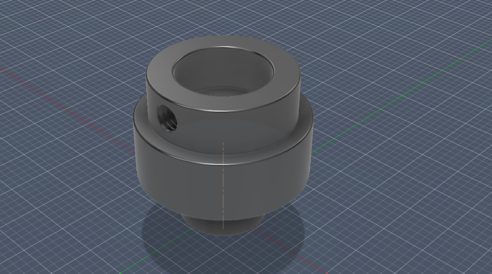
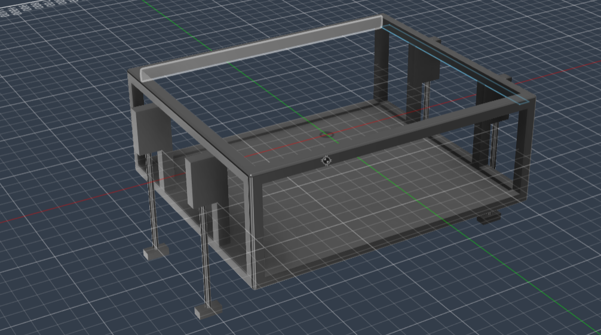
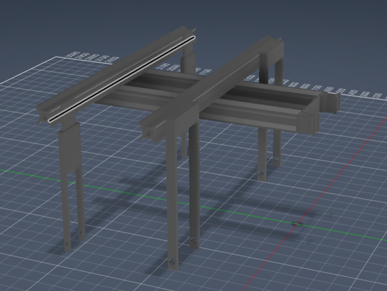
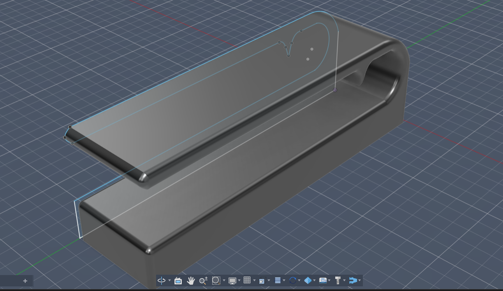

This reposistory contains a collection of 3d prints and 3d models. 

Coupler : 
Designed a 3D-modeled mechanical linkage system to connect a DC motor with a pneumatic actuator for a robotic arm prototype intended for amputee support applications. 
The model was developed to integrate motor control and pneumatic joint movement using Arduino-based control systems.

Tiller 1 : 
Contributed to the first prototype of an autonomous agricultural rover developed for agricultural automation applications. The design was used for preliminary estimation and integration of wheelbase, engine positioning, and electric motor systems. The rover employed a series hybrid architecture where the internal combustion engine functioned as a generator to provide electrical power to the drivetrain motor, supporting efficient energy management and modular power delivery.

Tiller 2: 
Second prototype design developed to improve ground clearance and enhance structural rigidity of the agricultural rover, enabling better terrain adaptability and stronger chassis support for field applications.

Tracheotomy_Aid_Prot :
Prototype assistive alert device developed for tracheotomy patients with limited mobility and communication ability. The system was designed to help semi-sedated patients call for assistance using a button-triggered buzzer mechanism integrated into a compact 3D-printed, battery-powered prototype to evaluate feasibility and practical usability.

 Prototype assistive alert device developed for tracheotomy patients with limited mobility and communication ability. The system was designed to help semi-sedated patients call for assistance through a button-triggered alert mechanism. The prototype consisted of a compact 3D-printed, battery-powered device connected via Bluetooth to a central hub used by nurses or attendants, enabling remote patient assistance and improved accessibility.

 
